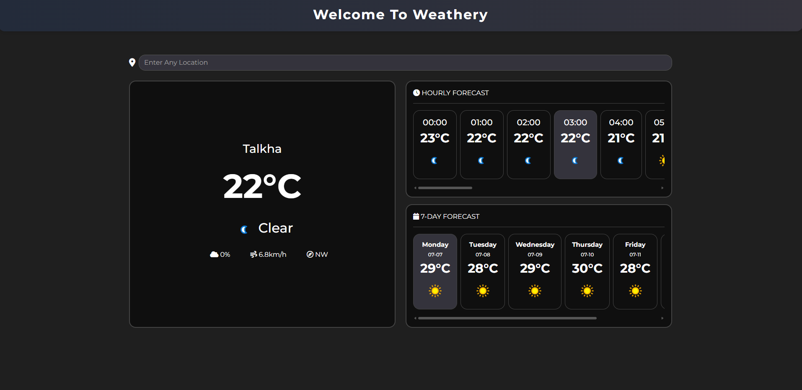

# Weathery

**Weathery** is a modern, responsive weather dashboard web app built with HTML, CSS (Bootstrap & custom styles), and JavaScript. It provides real-time weather information, hourly forecasts, and a 7-day outlook for any location worldwide.

## Features

- **Live Weather Search:** Instantly fetches and displays weather data as you type a location.
- **Current Weather:** Shows temperature, condition, wind, humidity, and more for the selected city.
- **Hourly Forecast:** Scrollable, visually enhanced hourly weather cards with current hour highlighting.
- **7-Day Forecast:** Scrollable, easy-to-read daily forecast cards with day names and weather icons.
- **Auto-Detect Location:** On page load, detects your current location and displays local weather.
- **Dark Mode UI:** Clean, modern dark-themed interface with accent colors and smooth scrollbars.
- **Responsive Design:** Fully responsive layout for desktop and mobile devices.
- **Accessible:** Uses semantic HTML and accessible color contrasts.

## Tech Stack

- **HTML5** & **Bootstrap 5** for structure and layout
- **CSS3** (custom properties, flexbox, gradients, scrollbars)
- **Font Awesome** for icons
- **JavaScript (ES6+)** for API integration and dynamic UI
- **WeatherAPI.com** for weather data

## How It Works

1. Enter a location in the search bar, or let the app auto-detect your location.
2. The app fetches weather data from WeatherAPI and updates the UI in real time.
3. View current conditions, hourly breakdown, and a 7-day forecast—all styled for clarity and usability.

## Screenshots

